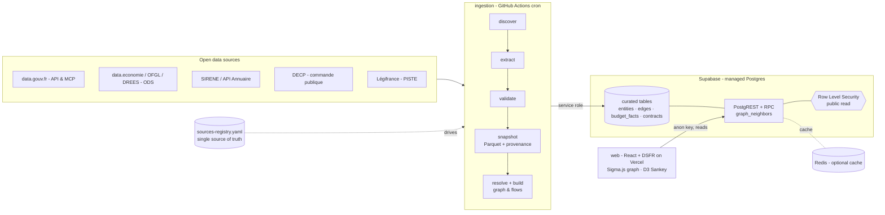
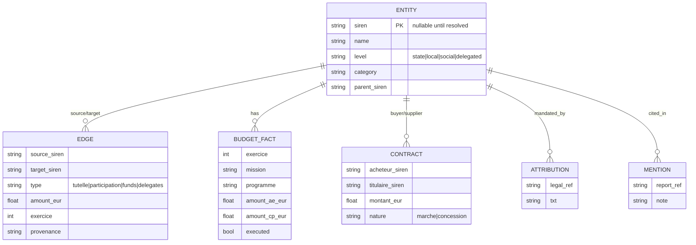

# Architecture

**Mission.** An interactive, maintainable tool that shows how French public institutions
are linked, funded, mandated, and how public money flows out to delegated (public and
private) operators — built entirely on open data.

This document is the target architecture. It is intentionally opinionated so contributors
(human and AI) share the same mental model. Key decisions are recorded as [ADRs](docs/adr/).

---

## 1. Principles

1. **Registry-driven.** Every source is declared in `data/registry/sources-registry.yaml`.
   No dataset slug or URL is hardcoded anywhere else.
2. **Discovery over hardcoding.** Datasets are resolved at runtime via the data.gouv.fr
   `/api/1` catalog (organisation + tag + millésime), never via a frozen slug.
3. **Schema contracts, fail loud.** Every extract is validated against its Table Schema
   (schema.data.gouv.fr). A column drift fails ingestion with an alert — never a silent load.
4. **Provenance & reproducibility.** Raw extracts are snapshotted with source + date +
   license. The curated database can always be rebuilt.
5. **SIREN is the join key.** Entities reconcile on SIREN first; hard cases go to a reviewed,
   versioned crosswalk — never guessed, never silently dropped.
6. **Curated in Postgres, heavy in Parquet.** Only the curated graph + aggregates live in
   Supabase. Raw/heavy extracts (DECP, SIRENE) stay as Parquet artifacts.
7. **No bespoke API server.** The frontend reads Supabase directly (PostgREST + RPC) under
   Row Level Security (public read). See [ADR-0005](docs/adr/0005-supabase-vercel-baas.md).
8. **Phased perimeter.** Build State-central first, then extend outward. See [ROADMAP](ROADMAP.md).

---

## 2. System overview



Each stage is isolated: when a source changes, only its registry entry (and at most its
connector) is touched — never the model, the database, or the UI.

---

## 3. Components

| Part | Tech | Responsibility |
|---|---|---|
| `packages/ingestion` | Python, httpx, frictionless, duckdb, typer | Registry-driven connectors: discover → extract → validate → snapshot → stage. Runs in GitHub Actions. |
| `packages/core` | Python, pydantic | Domain model, entity resolution (SIREN + crosswalk), graph & flow construction. |
| `supabase/` | SQL migrations + RPC + RLS | Schema, public-read policies, `graph_neighbors` function. **This is the API.** |
| `packages/web` | React, Vite, TS, DSFR, Sigma.js, D3, supabase-js | Reads Supabase directly; graph explorer, funding Sankey, entity sheets. Hosted on Vercel. |
| `data/registry` | YAML | The source registry (single source of truth). |
| orchestration | GitHub Actions cron | Monthly refresh; writes curated data to Supabase. |
| cache | Redis (optional) | Cache expensive RPCs; ingestion coordination. |

**Storage split.** Heavy, messy staging happens in DuckDB/Parquet during ingestion (cheap,
reproducible). Only curated, query-ready data — entities, typed edges, budget facts,
contracts — is loaded into **Supabase Postgres** (Pro: 8 GB, ample headroom). Graph traversal
is a recursive-CTE SQL function exposed as a PostgREST **RPC**; if deep traversal ever
outgrows it, the Postgres **Apache AGE** extension is a possible next step (see [ADR-0002](docs/adr/0002-postgresql-service-backed.md)).

---

## 4. Data model (core)



`Edge` is the heart of the product: a typed, directional, optionally-valued relationship
between two entities — what makes this a *graph*, not a budget table. Mirrored in
`supabase/migrations/0001_init.sql`.

---

## 5. Tech stack — choices & rationale

| Concern | Choice | Why | Alternative |
|---|---|---|---|
| Ingestion lang | Python | Data ecosystem; matches datagouv-mcp & frictionless | — |
| Schema validation | frictionless (Table Schema) | Same standard as schema.data.gouv.fr | pydantic-only |
| Staging | DuckDB + Parquet | Zero-infra, fast, reproducible | SQLite |
| Database + API | **Supabase** (Postgres + PostgREST + RPC) | One managed tier; no server to run | self-hosted Postgres + API |
| Graph query | recursive-CTE SQL function (RPC) | In-DB, no server | Apache AGE / Neo4j |
| Auth / access | Supabase RLS (public read) | Built-in, declarative | — |
| Frontend | React + Vite + TS | Ecosystem; graph libs | SvelteKit |
| Frontend host | **Vercel** (Hobby, free) | git-push deploys, great DX | Netlify / Cloudflare Pages |
| Graph viz | Sigma.js + graphology | Large graphs in WebGL | Cytoscape.js |
| Flow viz | D3 (Sankey) | Best-in-class flows | — |
| UI system | @gouvfr/dsfr | Official French State design system | plain CSS |
| Cache | Redis (optional) | Cache heavy RPCs | — |
| Orchestration | GitHub Actions cron | Free; matches data cadence | Prefect |
| Server logic (future) | Vercel Functions | Serverless; only if ever needed | — |

---

## 6. Repository layout

```
cartographie-fonds-publics/
├── data/registry/sources-registry.yaml   # single source of truth
├── packages/
│   ├── ingestion/   # discover · extract · validate · snapshot · stage (GitHub Actions)
│   ├── core/        # models · entity resolution · graph/flows
│   └── web/         # React + DSFR frontend (Vercel), reads Supabase
├── supabase/migrations/                   # schema · RLS · graph RPC  (this is the API)
├── spikes/phase0_siren_match/             # runnable Phase-0 proof
├── docs/adr/                              # architecture decision records
├── .github/ · vercel via packages/web/vercel.json
└── ARCHITECTURE.md · CLAUDE.md · ROADMAP.md · DEPLOYMENT.md
```

---

## 7. Deployment

Supabase (DB+API) + Vercel (frontend) + GitHub Actions (ingestion) + Redis (optional).
Roughly **$25/mo** (Supabase Pro; the rest on free tiers). See **[DEPLOYMENT.md](DEPLOYMENT.md)**.

## 8. Security & privacy

- Only public open data (Licence Ouverte / Etalab 2.0). Code under AGPL-3.0.
- Frontend uses the **anon key** with **RLS public-read**; the **service-role key** is used
  only by the ingestion job (GitHub Actions secret) and never shipped to the browser.
- The graph is organisational: minimise personal data (annuaire dirigeants, natural-person
  suppliers). Secrets via env / CI secrets; raw snapshots never committed.

## 9. Performance & scale

- Filter SIRENE to the public-sector subset; don't ingest all 36M establishments.
- Partition contracts by year; precompute aggregates; cache heavy RPCs in Redis.
- Curated tables only in Postgres; raw data as Parquet artifacts (Supabase Storage / release).
